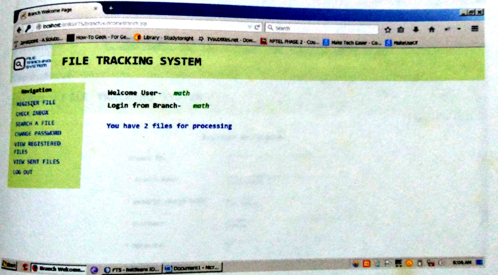
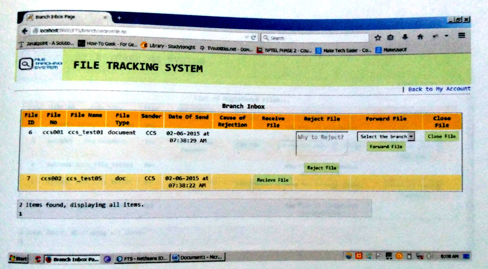
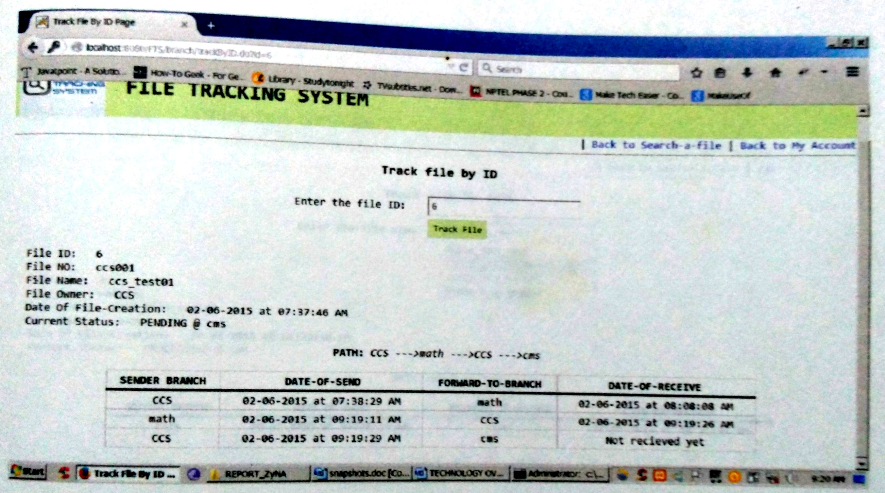
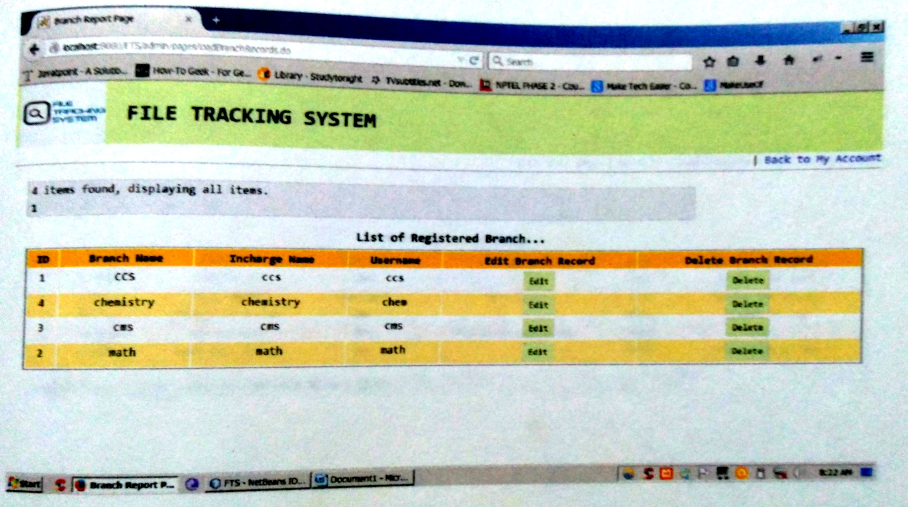

# File Tracking System
FTS is a JAVA EE web application that keeps track of all the files that move
around different offices/departments of an organisation until they reach their
destination. Every department needs to register the arrival and departure of files.
When anyone searches for a file in FTS, it then displays the track of the file’s
movement in a graphical format.

### Some snapshots of the App

*  
*  
*  
* 
